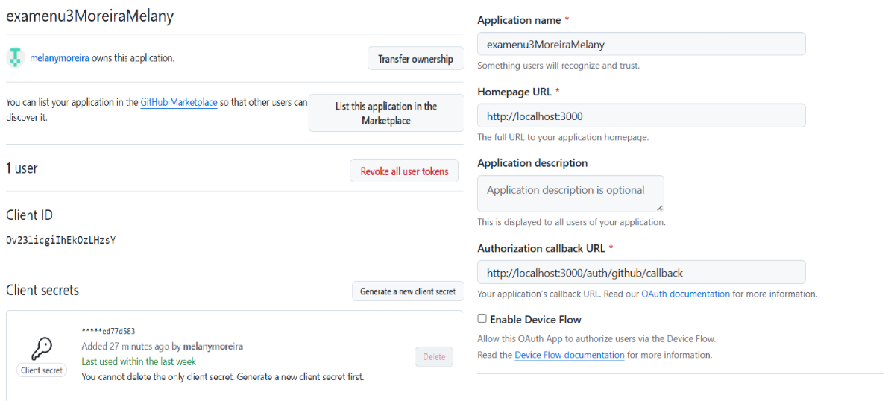
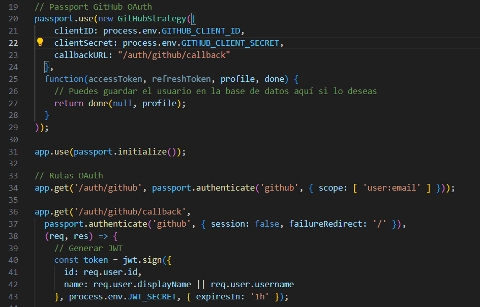
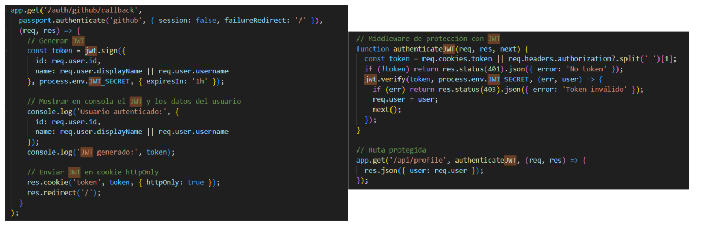
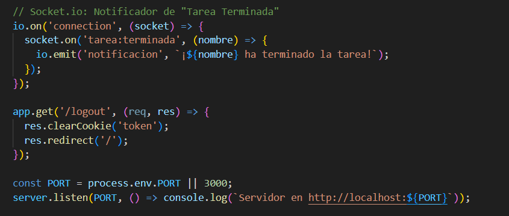
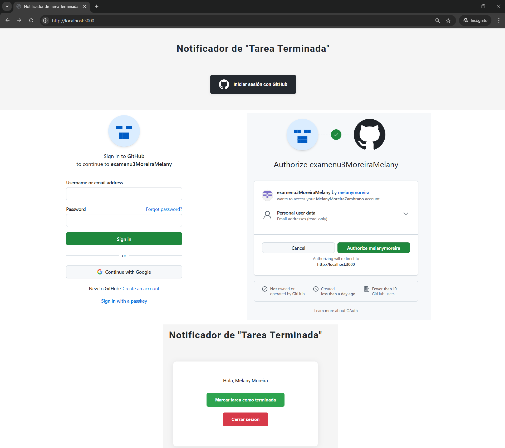
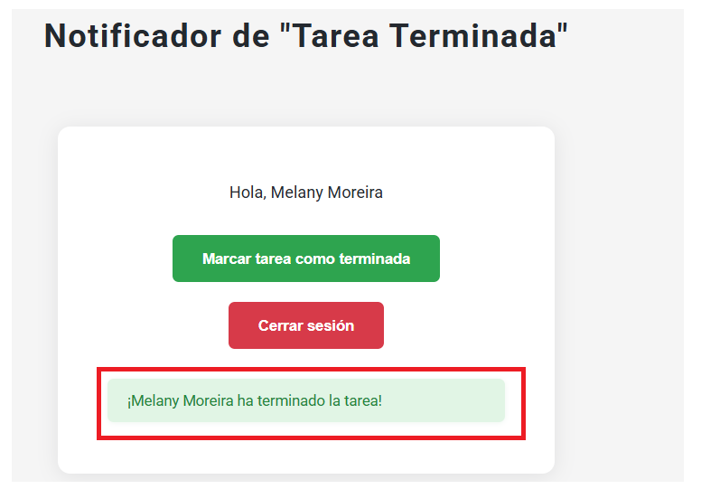
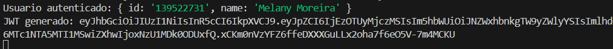

| **DEPARTAMENTO:** Ciencias de la Computación | **CARRERA:** Ingeniería en Tecnologías de la Información |
|----------------------------------------------|----------------------------------------------------------|
| **ASIGNATURA:** Aplicaciones Distribuidas    | **NIVEL:** 7to           | **FECHA:** 13/08/2025     |
| **DOCENTE:** Ing. Paulo Galarza              | **PRÁCTICA N°:**        | **CALIFICACIÓN:**         |

# Notificador de "Tarea Terminada" - Examen U3

Este proyecto es un backend con autenticación OAuth 2.0 (GitHub), gestión de sesiones con JWT y notificaciones en tiempo real usando Socket.io. Permite a los usuarios marcar una tarea como terminada y notificar a todos los conectados.

---

## 🚀 Pasos para ejecutar el proyecto

1. **Clona el repositorio**
   ```bash
   git clone https://github.com/melanymoreira/ExamenU3_MoreiraMelany.git
   cd ExamenU3_MoreiraMelany
   ```

2. **Instala las dependencias**
   ```bash
   npm install
   ```

3. **Configura el archivo `.env`**
   Crea un archivo `.env` en la raíz del proyecto con el siguiente contenido:
   ```properties
   PORT=3000
   GITHUB_CLIENT_ID=Ov23licgiIhEkOzLHzsY
   GITHUB_CLIENT_SECRET=9fd260e458f16a1c8da6dcae2da299b5ed77d583
   JWT_SECRET=supersecreto
   ```

4. **Ejecuta el servidor**
   ```bash
   node index.js
   ```
   o con nodemon:
   ```bash
   npx nodemon index.js
   ```
   
5. **Abre la aplicación en tu navegador**
   ```
   http://localhost:3000
   ```
   ó
   ```
   examenu3moreiramelany-production.up.railway.app
   ```
---

## ✨ Funcionalidad

- Inicia sesión con GitHub.
- Marca la tarea como terminada.
- Todos los usuarios conectados reciben la notificación en tiempo real.
- Puedes cerrar sesión y volver a ingresar con otra cuenta.

---

## 📸 Capturas de pantalla

### 1. Crear OAuth App en GitHub

Muestra cómo registraste la aplicación en GitHub para obtener el Client ID y Client Secret.



---

### 2. Implementar OAuth 2.0 (Código)

Fragmento de código donde configuras las rutas y lógica de OAuth con Passport.js.



---

### 3. Implementar JWT (Código)

Fragmento de código donde generas y verificas el JWT.



---

### 4. Implementar Socket.io

Fragmento de código donde configuras y usas Socket.io para las notificaciones en tiempo real.



---

### 5. Login

Pantalla de inicio de sesión con el botón de GitHub.



---

### 6. Notificación

Pantalla donde se muestra la notificación global cuando un usuario marca la tarea como terminada.



---

### 7. Token en consola

Captura de la consola del servidor mostrando el JWT generado y los datos del usuario autenticado.



---

---

## 📝 Notas

- El JWT se genera al iniciar sesión y se muestra en la consola del servidor.
- El botón "Cerrar sesión" elimina la cookie y permite volver a ingresar con otra cuenta.
- Para producción, recuerda configurar correctamente las variables de entorno y la URL de callback en GitHub.

---
